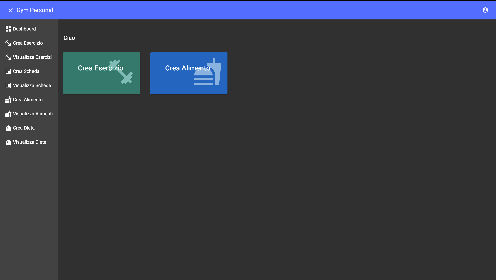
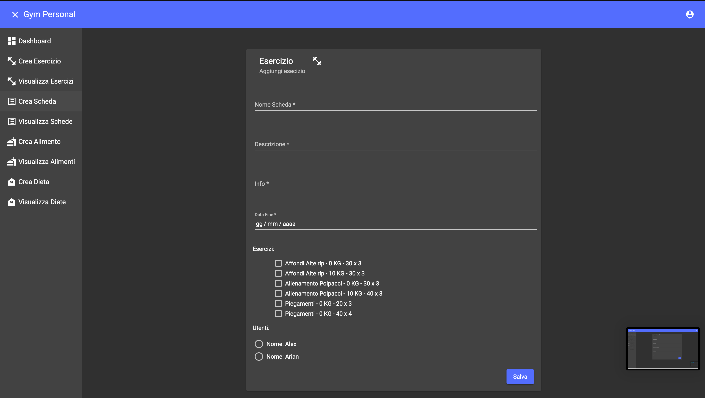
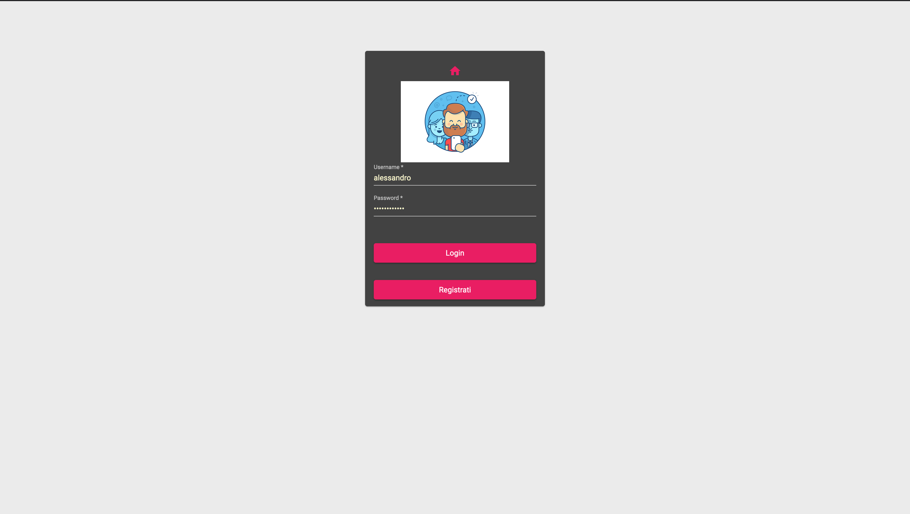
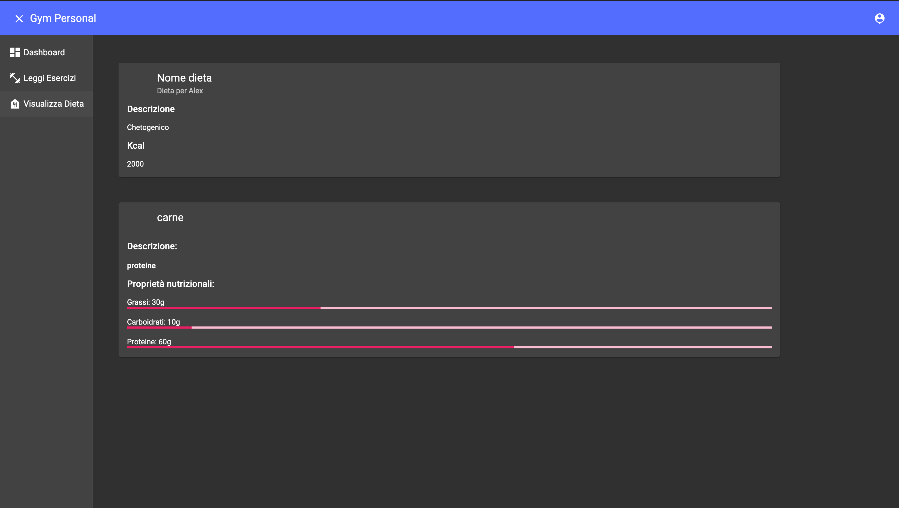

# Angular10MaterialGym
PWA Project - Gym Accademic project

[](https://angular.com/)
[](https://developer.mozilla.org/en-US/docs/Web/Guide/HTML/HTML5)
[](https://www.typescriptlang.org/)

## Description
This project is developed in Italian without internationalization.
The goal was to manage the diet and exercises for a particular user. Each diet has a set of foods and each card has a set of exercises.
Registration is intended for the simple user only. The admin manages diets, cards, exercises and foods.

## Topics
* Angular Material Design
* Angular
* TypeScript
* Sass
* Material-angular-select
* JWT
* Observable
* YouTubePlayerModule
* MatProgressSpinnerModule

## Setup
To run this project, install it locally using npm:

```
$ npm install
$ ng serve

```

## Images
Front

Admin

Add Exercise

Registration

View Exercise


## Server 
https://github.com/alexraimondi91/Gym
